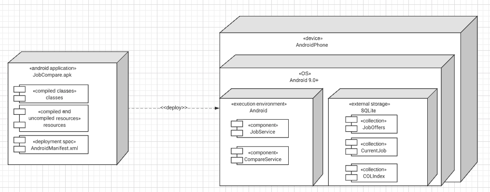
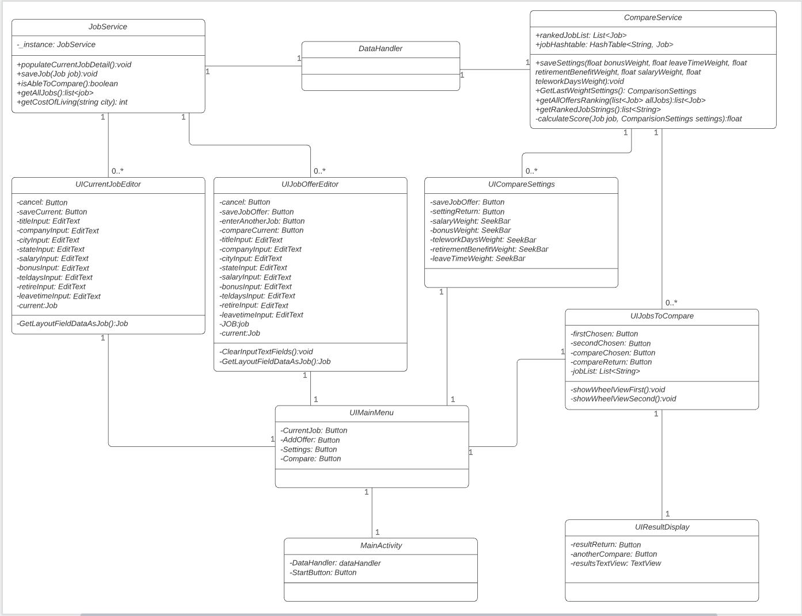
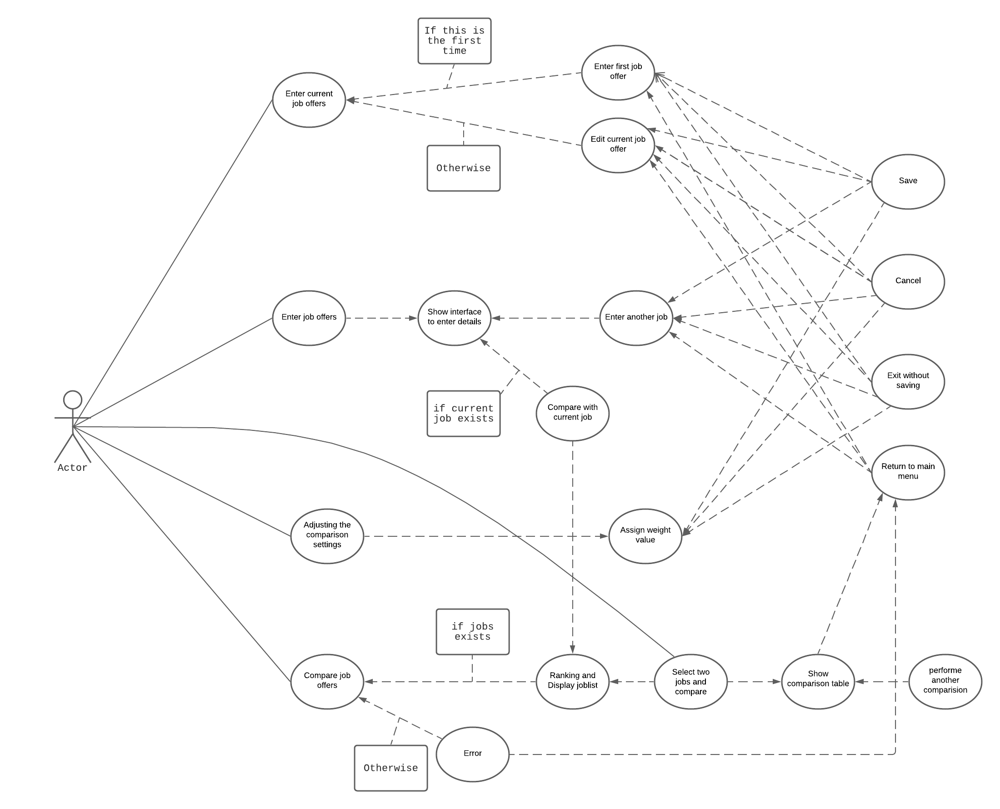
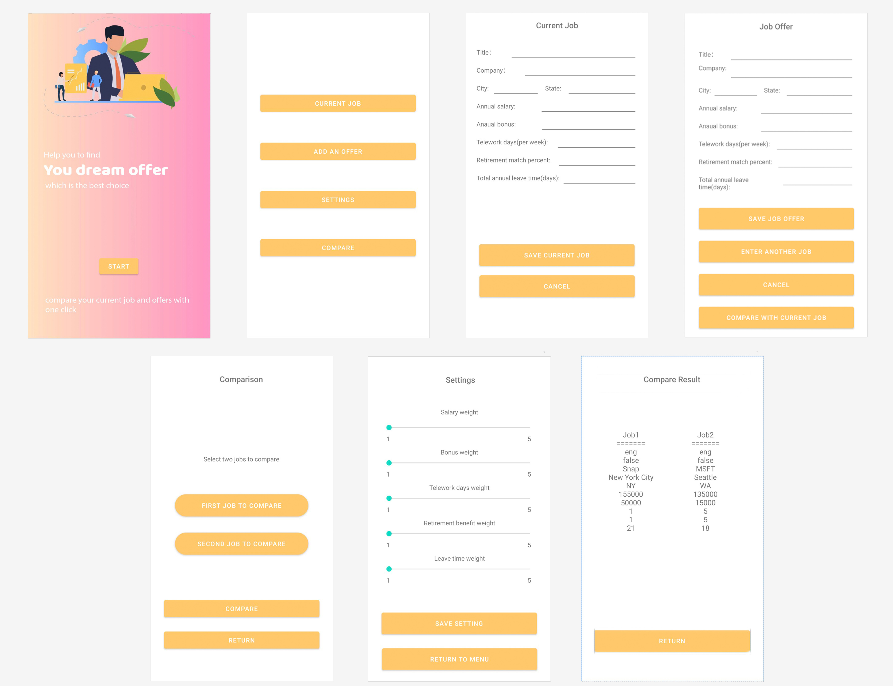

# Design Document

Version 1.0 - 3/13 updated UI design
Version 2.0 - 3/20 updated assumptions for cost of living source data, updated class diagram

**Author**: Team115

## 1 Design Considerations

### 1.1 Assumptions

We assume the JobCompare app will be used by a single Android user that only has at most one current job at a time. Entered job offers are immutable so the user will not be able to delete or edit once the job offer is saved. We assume the Cost of living indexes from  are correct. For any city that does not have a cost of living index from the source or not ranked in top 102, we assum an index of 100.

Our app will only be offered in Android OS and we are only supporting android version 9.0 and above. APK is provided to install the app on the phone.

### 1.2 Constraints

We require the input language to be english only and salary in USD only. All jobs, including current job and job offers, have to reside within the United States.

All input fields are required for current job and job offers and subject to length restrictions or min/max requirements. 

### 1.3 System Environment

JobCompare app requires an Android operating system with a minimum version of 9.0 - Android Pie.

## 2 Architectural Design

### 2.1 Component Diagram

JobCompare is a single component android app which doesn’t require any interaction with other applications or web services. This app only uses user entered data to provide comparison results. Thus, the component diagram is ignored in our design.

### 2.2 Deployment Diagram

## 3 Low-Level Design

### 3.1 Class Diagram

### 3.2 Other Diagrams

## 4 User Interface Design

