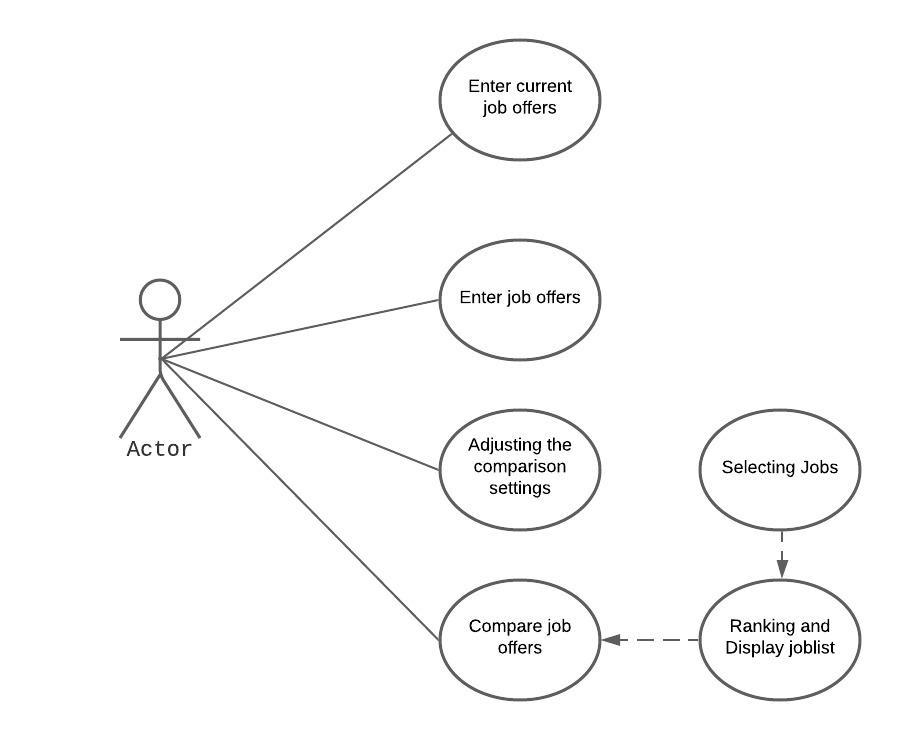

# Use Case Model

Version 1.0 - 3/20 updated button names according to interface

**Author**: Team115

## 1 Use Case Diagram

## 2 Use Case Descriptions

##### Enter current job offer
Requirement: Allow the user to enter or edit current job offer.
Pre-conditions: No pre-condition.
Post-conditions: Nothing changed or there is a current job offer saved in the database.
Scenarios:
* Primary Path:
<<<<<<< HEAD
1. Click on the CURRENT JOB details button.
=======
1. Click on the 'CURRENT JOB' button from main menu.
>>>>>>> 8599adbf4ded65445f41e6eb02028c1e40029d99
2. An interface is shown for users to enter current job offer details.
3. Edit all of the details of the current job.
4. Save the job details or cancel and exit without saving.

* Alernate Path:
1. Continue from step 2 of Primary Path.
2. If this is the first time, enter the details of the current job offer.
3. Return to step 3 of Primary Path.

##### Enter job offers
Requirement: Allow the user to enter multiple job offers.
Pre-conditions: No pre-condition.
Post-conditions: Nothing changed or there are job offers saved in the database.
Scenarios:
* Primary Path:
<<<<<<< HEAD
1. Click on the ADD AN OFFER button.
=======
1. Click on the 'ADD AN OFFER' button.
>>>>>>> 8599adbf4ded65445f41e6eb02028c1e40029d99
2. An interface is shown for users to enter job offers details.
3. Enter the details of the job offer.
4. Save the job details or cancel and exit without saving.

* Alternate Path 1:
1. Continue from step 3 of Primary Path.
2. Click the ENTER ANOTHER JOB button. 
3. Return to step 2 of Primary path.

* Alternate Path 2:
1. Continue from step 3 of Primary Path.
2. Click the COMPARE WITH CURRENT JOB button to compare the offer with current job details.
3. Throw error if there is no current job offer in the database, or shown an interface displaying the ranking and job list.
4. Return to step 2 of Primary Path.

##### Adjusting the comparison setting 
Requirement: Allow the user to adjust the weight of comparison parameters for ranking.
Pre-conditions: No pre-condition.
Post-conditions: Weights are assigned or remain default. 
Scenarios:
* Primary Path:
<<<<<<< HEAD
1. Click on the SETTINGS button.
=======
1. Click on the 'SETTINGS' button.
>>>>>>> 8599adbf4ded65445f41e6eb02028c1e40029d99
2. An interface is shown for users to adjust the weight of comparison settings.
3. Save the comparison settings or cancel and exit without saving.

##### Compare job offers
Requirement: Display the job offers as ranked list, and allow users to choose and compare specific offers.
Pre-conditions: Jobs are available in the database.
Post-conditions: The result of comparison is displayed as a list.
Scenarios:
* Primary Path:
<<<<<<< HEAD
1. Click on the COMPARE button.
=======
1. Click on the 'COMPARE' button.
>>>>>>> 8599adbf4ded65445f41e6eb02028c1e40029d99
2. A list of job offers are displayed as a ranked list.
3. Choose two jobs to compare and trigger the comparison.
4. A table is shown with details as a result of the comparison.
5. Click the Go back to the main menu button to go back to the menu.

* Alternate Path:
1. Continue from step 4 of Primary Path.
2. Click on the Perform another comparison button.
3. Return to step 2 of Primary Path.

* Exception Path:
1. Click on the COMPARE button.
2. An empty list of offers is shown if there are no job offers in the database.
3. Click on the Trigger Comparison button.
4. Throw an error message stating “There are no job offers to compare!”.
