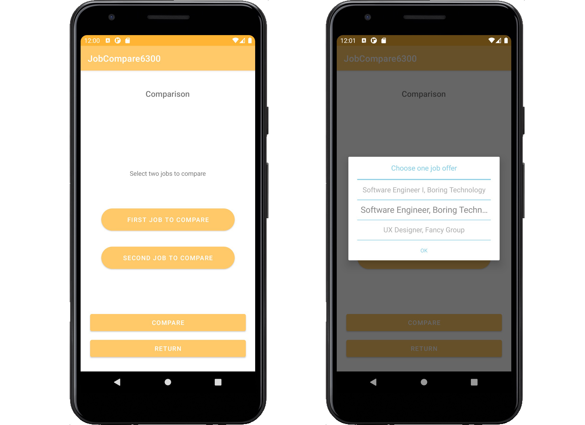
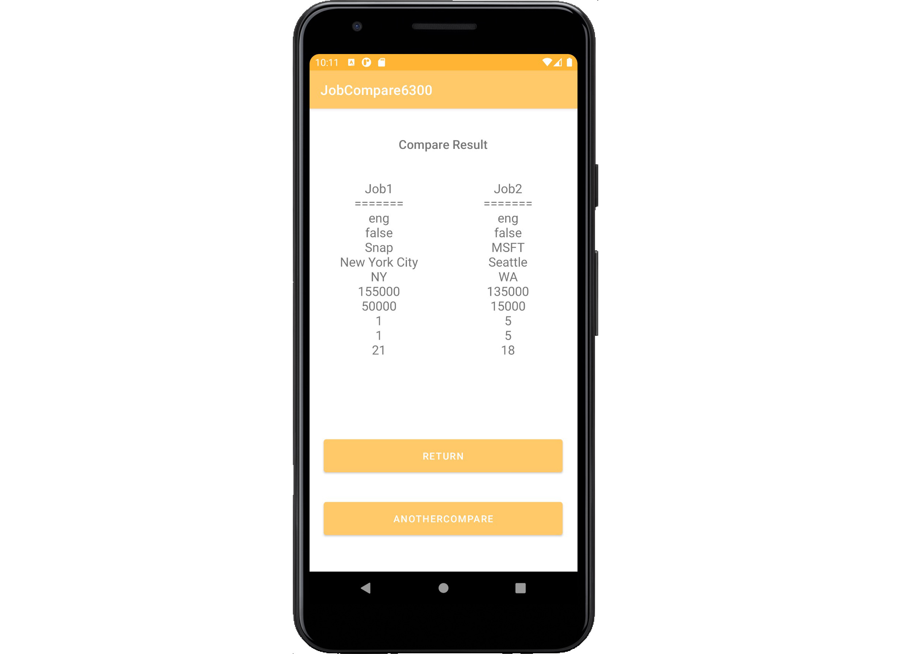

Version 1.0 - 3/20 updated screenshots and function descriptions.

This application allows you to compare your current job to job offers, or compare job offers. Simply, you input job details and then can compare the entered jobs.

# How To Use The App
Open the JobCompare6300 app, press the "START" button.
You’ll now be at the JobCompare6300 main menu.
Each button on the main menu allow you to perform an action.
The user can perform the following actions:
* Enter current job offer
* Enter job offers
* Adjust the comparator settings
* Choose jobs to compare

## CURRENT JOB
By pressing this button, the user will be able to add/view/edit your current job entry. To finalize changes in the Current Job screen, press the “SAVE CURRENT JOB” button. If the user does not want to save the changes or want to return to the main menu, press the "CANCEL" button or use your device’s back button.

## ADD AN JOB OFFER
To add a job offer to be evaluated, fill in all required fields and click “SAVE JOB OFFER”. After the job offer is entered, the user should have an option to “ENTER ANOTHER JOB” or “CANCEL” out of the page. If the current job exists, the user can “COMPARE WITH CURRENT JOB”.

## SETTINGS
The user is allowed to set the weights(1-5) on the following job aspect:

* Yearly salary weight
* Yearly bonus weight
* Allowed weekly telework days weight
* Retirement benefits weight
* Leave time weight

Weights will be used for rank jobs when selecting for comparison.

## COMPARE
When choosing to compare, the user is offered to select two jobs to compare side by side. Click on the “FIRST JOB TO COMPARE” to select the first job. A wheel view dialog of all entered jobs will appear and allow the user to select. All of the jobs displayed in the wheel view dialog are already ranked according to the current comparator setting. Same applies to the “SECOND JOB TO COMPARE“. 

## Result

After both jobs have been selected, and the “COMPARE” button is clicked, a result page of side to side comparison will show up and allow the user to compare. Another compare can also operate by clicking "ANOTHER COMPARE". “RETURN” will get the user back to the menu page.

