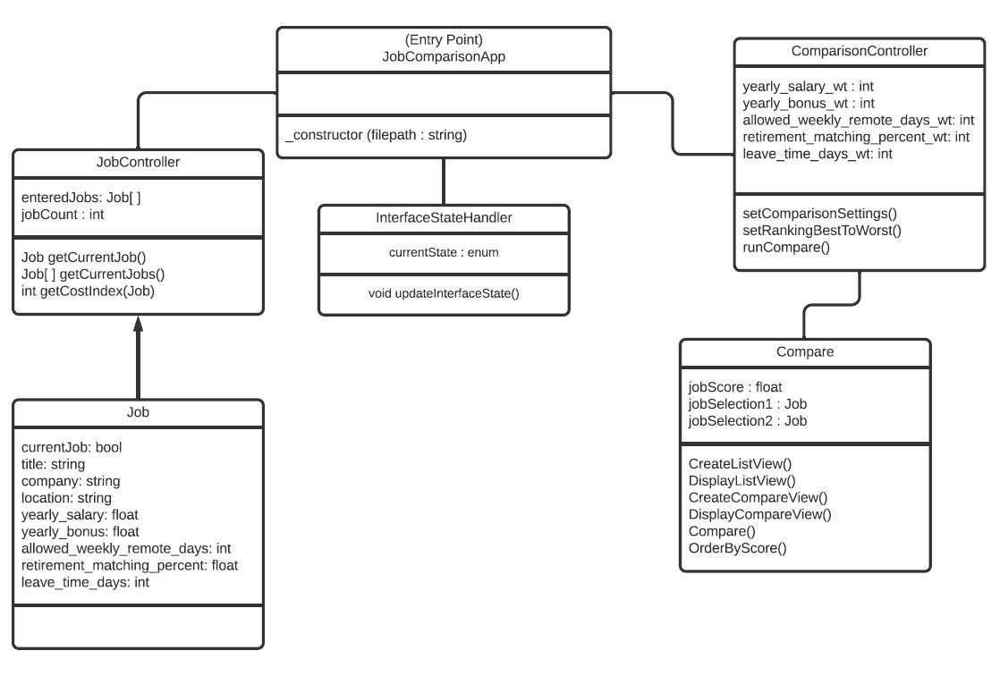
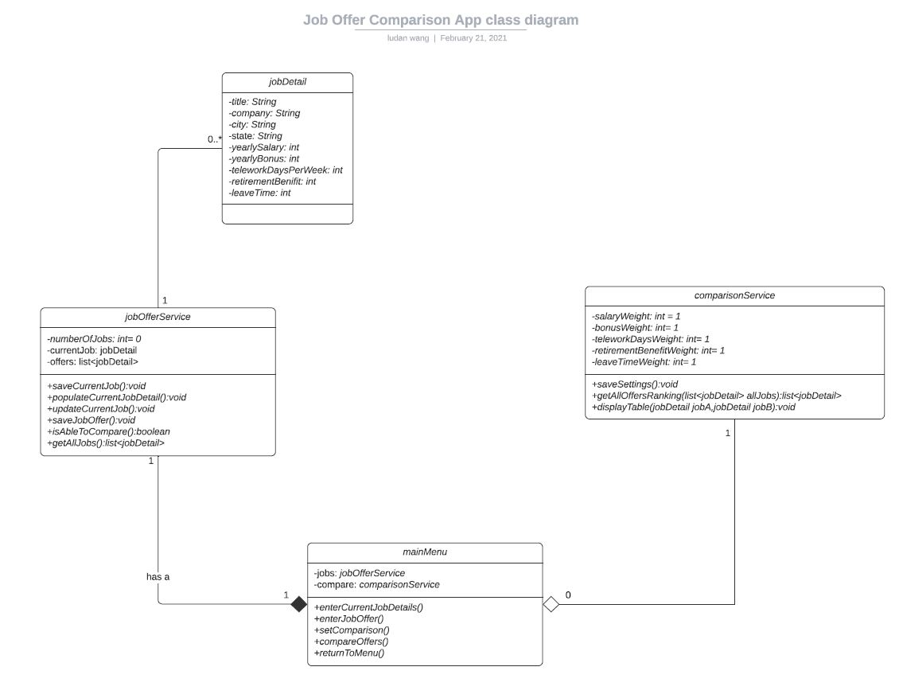
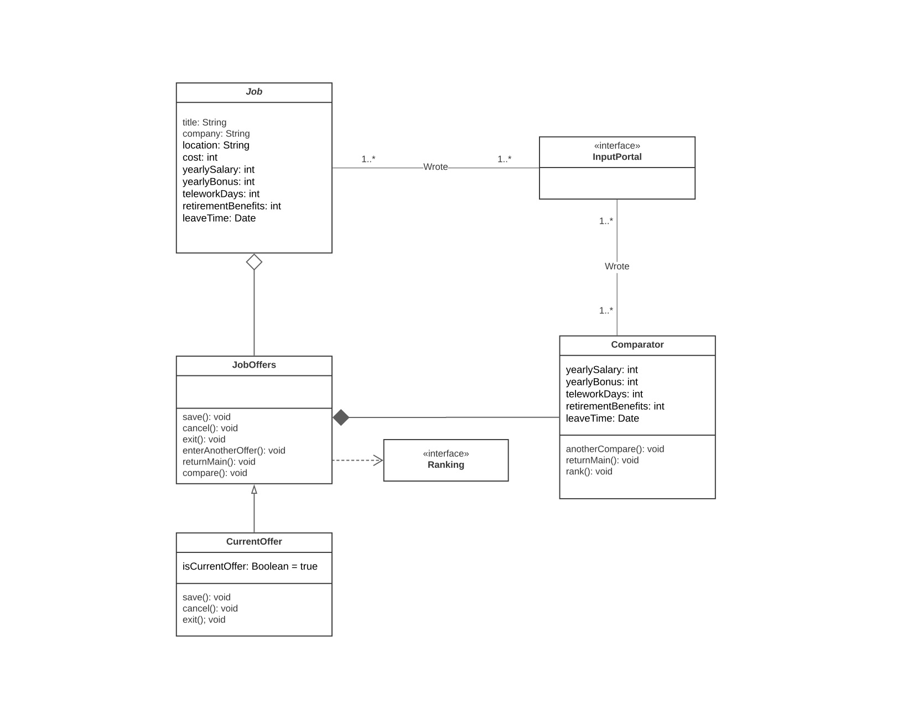
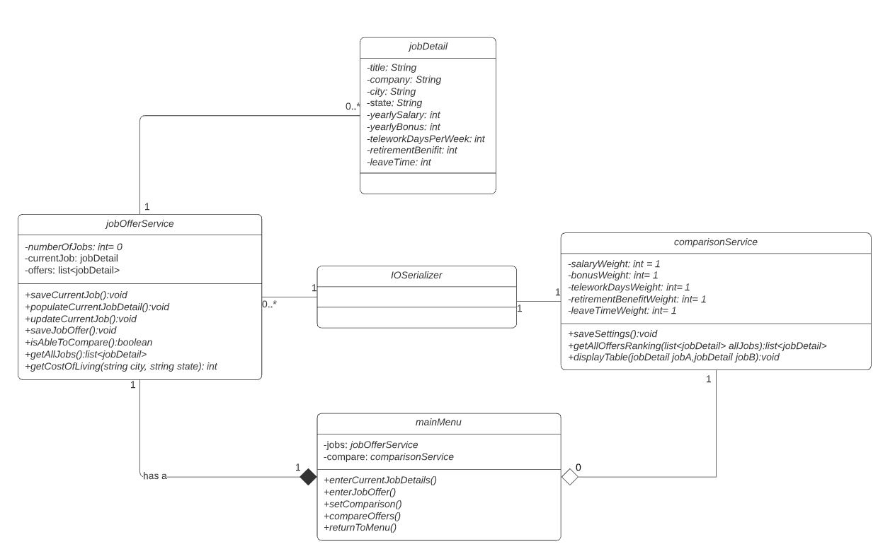

# Assignment: GroupProjectD1

## Design 1

Pros: 
* have functionanility of saving data to the file system to boost robustness 
* comprehensive operations for each requirements
 
Cons:
* relationships between classes are missing

## Design 2

Pros:
* simple design
* microservice design could be helpful in the future if need to be convert to an API

Cons:
* missing cost of living calculation
* some CRUD may not needed

## Design 3

Pros:
* Straight forward and clean
* class relationships are clear and correct
* simple connections between InputPortal and jobs/comparator

Cons:
* missing cost of living calculation
* currentOffer and jobOffers could be consolidated for simplicity

## Team Design

After review all three designs, we choose to use the second design as the base for our team's design considering it is a semi-API approach. Each service can be extended to a tool/API if needed in the future. On top of the second design, we added a method to calculate the cost of living in jobOfferService. Secondly, we also added an IOSerializer based on design 1 to handle all data saving so we will not lose any data in case of closing the app. 

## Summary
The process of discussing the designs helps with making our final team design more thorough. When we analyzing the pros and cons of each design, each of us could find something that we overlooked in our individual designs. As a result, the overlooked pieces are being considered when working on the team's design such as the calculation of the cost of living. Another thing we learned is that prep work before the discussion is very important. In our case, every team member has read through the requirements and each other's designs ahead of the meeting which makes our design discussion extremely effective.
